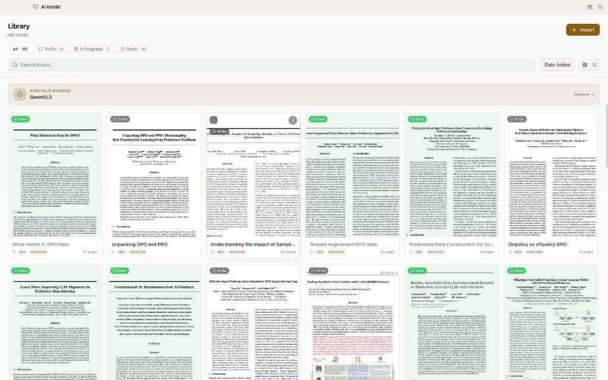

<div align="center">

# AI Kindle

**A fast, local, privacy-first PDF study companion for your desktop.**

Keep a searchable library of PDFs, annotate them with highlights and notes, write long-form Markdown notes alongside each book, open two books side-by-side, and ask an AI to summarize, explain, or chat about what you're reading — all without uploading your documents anywhere.

[]()
[]()
[]()
[]()

</div>



---

## Why AI Kindle?

Most desktop PDF readers are either dumb (no notes, no search, no progress) or cloud-bound (Adobe, Kindle, Notion AI). AI Kindle is built for people who read a lot of PDFs — research papers, textbooks, long-form articles — and want one app that:

- **Stays local.** Every PDF, annotation, note, and AI conversation lives in `~/.config/ai-kindle/` (or the macOS / Windows equivalent). Nothing is uploaded.
- **Scales.** The library grid is virtualized, thumbnails cache as JPEGs, and the reader only renders pages near the viewport — 500-page books open instantly.
- **Has real annotations.** Five-color highlights with clean per-line rects, sticky comments, inline text notes, all exportable to Markdown.
- **Has real AI.** Optional OpenAI / Azure OpenAI integration for summaries, explanations, and chat over your highlights — bring your own key.
- **Has good keyboard ergonomics.** ⌘K command palette, ⌘B / ⌘J panel toggles, ⌘D theme, Esc to leave a book.

## Table of contents

- [Features](#features)
- [Installation](#installation)
  - [Ubuntu / Debian (.deb)](#ubuntu--debian-deb)
  - [Any Linux (AppImage)](#any-linux-appimage)
  - [macOS](#macos)
  - [Updating](#updating)
- [Quick start](#quick-start)
- [Configuration](#configuration)
  - [AI provider](#ai-provider)
  - [Where your data lives](#where-your-data-lives)
- [Usage](#usage)
- [Keyboard shortcuts](#keyboard-shortcuts)
- [Syncing across devices](#syncing-across-devices)
- [Build from source](#build-from-source)
- [Architecture](#architecture)
- [Troubleshooting](#troubleshooting)
- [License](#license)

---

## Features

| Area | What you get |
|---|---|
| **Library** | Grid + list views, fuzzy search, sort by Date Added / Last Read / Title, status tabs (All / To Do / In Progress / Done), drag-and-drop import, "Continue Reading" banner that resumes your last session |
| **Import** | File picker or bulk folder import, duplicate-content detection (SHA-256), atomic file copy so crashes never leave half-imported files |
| **Reader** | Virtualized page rendering, pinch-to-zoom with anchor preservation, instant TOC jumps, selectable text, page counter |
| **Annotations** | 5-color highlights with per-line rects, sticky-note comments, inline text notes, Markdown export of all notes |
| **Notes** | Per-book Markdown editor with live preview and autosave |
| **Tabs & split view** | Multiple books open at once; "Open to the right" puts a second book in a secondary pane |
| **AI** | OpenAI / Azure OpenAI streaming chat, summarize / explain on any selection, conversation history per book — bring your own key |
| **Themes** | Light and dark |
| **Productivity** | Command palette (⌘K), shift / ⌘-click bulk selection, recents, resume-last-session |
| **Privacy** | No telemetry. No account. No sync server. Your data never leaves your machine unless you actively chat with the AI |

---

## Installation

Prebuilt installers are attached to every [GitHub release](https://github.com/vishalsingha/AI_Kindle/releases). Pick your platform below.

### Ubuntu / Debian (.deb)

```bash
VERSION=1.2.3   # or whatever's latest on the releases page

wget -O "/tmp/ai-kindle_${VERSION}_amd64.deb" \
  "https://github.com/vishalsingha/AI_Kindle/releases/download/v${VERSION}/ai-kindle_${VERSION}_amd64.deb"

sudo apt install -y "/tmp/ai-kindle_${VERSION}_amd64.deb"
```

AI Kindle will appear in your **Activities / app launcher** (search "ai kindle" or "pdf") and as an "Open With" option when you right-click any PDF in Files / Nautilus. You can also launch it from a terminal with `ai-kindle`.

#### One-command updates

Drop this script into `~/.local/bin/update-ai-kindle`, `chmod +x` it, and run it any time to install the latest release:

```bash
#!/usr/bin/env bash
# Install the latest AI Kindle .deb from GitHub releases.
set -euo pipefail
REPO="vishalsingha/AI_Kindle"
ARCH="${ARCH:-amd64}"

TAG=$(curl -fsSL "https://api.github.com/repos/$REPO/releases/latest" \
      | sed -nE 's/.*"tag_name": *"(v[^"]+)".*/\1/p' | head -n1)
VERSION="${TAG#v}"

INSTALLED=$(dpkg-query -W -f='${Version}' ai-kindle 2>/dev/null || echo "none")
if [[ "$INSTALLED" == "$VERSION" ]]; then
  echo "Already on $VERSION."; exit 0
fi

DEB="ai-kindle_${VERSION}_${ARCH}.deb"
TMP=$(mktemp -d); trap 'rm -rf "$TMP"' EXIT
curl -fL --progress-bar -o "$TMP/$DEB" \
  "https://github.com/$REPO/releases/download/$TAG/$DEB"
sudo apt install -y "$TMP/$DEB"
echo "✓ Now on $(dpkg-query -W -f='${Version}' ai-kindle)."
```

Then upgrades become:

```bash
update-ai-kindle
```

### Any Linux (AppImage)

```bash
VERSION=1.2.3
mkdir -p ~/Apps

wget -O "$HOME/Apps/AI_Kindle-${VERSION}.AppImage" \
  "https://github.com/vishalsingha/AI_Kindle/releases/download/v${VERSION}/AI%20Kindle-${VERSION}.AppImage"

chmod +x "$HOME/Apps/AI_Kindle-${VERSION}.AppImage"
"$HOME/Apps/AI_Kindle-${VERSION}.AppImage"
```

Portable — no installation, runs on any glibc-based distro.

### macOS

Download the latest `.dmg` from [Releases](https://github.com/vishalsingha/AI_Kindle/releases), open it, and drag **AI Kindle.app** into your `/Applications` folder. The build is currently **unsigned**, so on first launch you'll need to:

1. Right-click `AI Kindle.app` → **Open** → **Open** in the confirmation dialog (one-time prompt).
2. Subsequent launches work normally from Spotlight, Launchpad, or the dock.

> Building for Apple Silicon and Intel separately — pick the one matching your Mac. `arm64` for M-series, `x64` for Intel.

### Windows

Currently best installed from source — see [Build from source](#build-from-source). Native `.exe` and portable Windows installers are in `electron-builder.yml`'s plan but aren't yet attached to releases.

### Updating

- **Linux (.deb)**: `update-ai-kindle` (the script above), or manually `wget` + `apt install` the latest `.deb`.
- **Linux (AppImage)**: just download the new AppImage and run it. Delete the old one.
- **macOS**: drag the new `.app` over the old one in `/Applications`.
- Your data in the user-data directory ([see below](#where-your-data-lives)) is **never** touched by upgrades.

---

## Quick start

After installing:

1. **Launch** AI Kindle (from your app launcher or `ai-kindle` in a terminal).
2. **Drop a PDF** onto the library window — or click **Import → Import Files**.
3. **Click the cover** to open the reader at page 1.
4. **Select text** and pick a color from the floating toolbar to highlight.
5. **Press ⌘K** to bring up the command palette and jump anywhere.

(Optional) Open the AI panel (brain icon, or **⌘J**), pick OpenAI or Azure OpenAI, paste your API key, and ask away. Your key is encrypted in the OS keychain.

---

## Configuration

### AI provider

AI features are off by default and require you to bring your own credentials. AI Kindle speaks two protocol shapes:

| Provider | What you need | Where to get it |
|---|---|---|
| **OpenAI** | An API key starting with `sk-…` | [platform.openai.com/api-keys](https://platform.openai.com/api-keys) |
| **Azure OpenAI** | Endpoint + API key + API version + one or more deployment names | Azure Portal → your OpenAI resource |

To configure:

1. Open the AI panel with **⌘J** (or click the brain icon in the titlebar).
2. Pick **OpenAI** or **Azure OpenAI**.
3. Fill in the fields and click **Save & Connect**. AI Kindle validates by hitting `/models`.
4. Your key is encrypted via Electron's `safeStorage` (macOS Keychain, Windows DPAPI, kwallet / libsecret on Linux).

You can also point at any **OpenAI-compatible endpoint** (LiteLLM, OpenRouter, local vLLM, …) by changing the base URL under the OpenAI provider.

### Where your data lives

| Platform | Path |
|---|---|
| macOS | `~/Library/Application Support/ai-kindle/` |
| Linux | `~/.config/ai-kindle/` |
| Windows | `%APPDATA%\ai-kindle\` |

Inside that directory:

```
ai-kindle.db          SQLite — books, annotations, notes, conversations, settings
ai-kindle.db-wal/-shm Write-ahead log (managed by SQLite)
library/              Your imported PDFs (renamed to <id>.pdf)
thumbnails/           Cached JPEG covers
```

Back up the whole directory while the app is closed for a snapshot of everything. Delete it to reset.

Since v1.2.0, file paths inside `ai-kindle.db` are **stored as basenames and resolved at read time**, which means you can copy this directory between Mac / Linux / Windows installs and everything still works — see [Syncing across devices](#syncing-across-devices).

---

## Usage

### Library

The default view. 48-book grid pictured above. Hit ⌘K and start typing to jump to any book.

- **Status tabs** at the top: `All`, `To Do`, `In Progress`, `Done`. Books with at least one annotation are "In Progress"; manually marked books are "Done".
- **Continue Reading** banner resumes your last session with one click.
- **Search bar** filters across title, author, and tags.
- **Drag-and-drop** any PDFs or folders of PDFs to import. Duplicate detection by SHA-256.
- **Hover menu (⋯)** on each card: Mark Done / To Do, Show in Finder/Files, Delete.

### Reader

Click a book to open it. The reader has:

- **Sidebar (⌘B)** — table of contents, annotation list (grouped by page), Markdown export.
- **Center** — virtualized pages, only what's near the viewport is rasterized.
- **AI panel (⌘J)** — chat, summarize / explain on the current selection, conversation history.
- **Notes (right edge icon)** — a per-book Markdown editor with live preview.

Click "Mark Done" in the titlebar when finished.

### Annotations

Select text → pick a color from the floating toolbar (yellow, green, blue, pink, orange) for a highlight. Or pick the comment / text-note icons to add a sticky note.

Annotations are stored in SQLite keyed by book id. Multi-line highlights render as clean per-line rectangles rather than stacked layers. Use the sidebar to export everything as Markdown.

### Tabs and split view

Books open in tabs. Right-click a tab → **Open to the right** puts that book in a second pane next to the current one — great for textbook + cheatsheet workflows.

### AI

With a configured provider:

- **Selection toolbar** → sparkle icon = summarize, brain-circuit = explain.
- **AI panel** → free-form chat about the current book.
- **Annotation sidebar** → multi-select highlights and pick a template (study notes, flashcards, themes, quiz).

Responses stream token-by-token. Conversations are saved per-book in the local DB.

---

## Keyboard shortcuts

### Global
| Shortcut | Action |
|---|---|
| `⌘K` | Command palette |
| `⌘D` | Toggle dark mode |
| `Esc` | Back to library (from reader) |

### Reader
| Shortcut | Action |
|---|---|
| `Space`, `↑`, `↓`, wheel | Scroll |
| `PageDown` / `PageUp` | Next / previous page |
| `⌘→` / `⌘←` | Next / previous page |
| `Home` / `End` | First / last page |
| `⌘+` / `⌘-` | Zoom in / out |
| `⌘B` | Sidebar (TOC + annotations) |
| `⌘J` | AI panel |

### Library
| Shortcut | Action |
|---|---|
| Type | Focus search |
| `⌘`-click | Toggle single-book selection |
| `Shift`-click | Range-select books |

> On Windows / Linux, swap `⌘` for `Ctrl`.

---

## Syncing across devices

There's no built-in sync server — but because `~/.config/ai-kindle/` is a self-contained, portable directory (since v1.2.0), you have two clean options.

### Option 1: Manual transfer (Google Drive / USB / scp)

```bash
# On the source machine (app must be closed):
sqlite3 "$HOME/.config/ai-kindle/ai-kindle.db" "PRAGMA wal_checkpoint(TRUNCATE);"
tar -czvf ~/ai-kindle-data.tgz -C "$HOME/.config/ai-kindle" \
  ai-kindle.db library thumbnails

# Move the tgz to the target machine via Drive / USB / scp.

# On the target machine (app closed, first launch already done):
tar -xzvf ~/ai-kindle-data.tgz -C "$HOME/.config/ai-kindle"
```

Paths are stored as basenames internally and resolved against the target's library directory, so books open without any further fix-up.

On macOS the source/destination directory is `~/Library/Application Support/ai-kindle/` and you'll re-enter the API key once (the encrypted blob is OS-specific).

### Option 2: Continuous sync via Syncthing

Symlink the data directory on every device to a Syncthing-managed shared folder, e.g. `~/Sync/ai-kindle/`. As long as you only run the app on **one device at a time** (SQLite + concurrent writers = corruption), every annotation made on machine A appears on machine B within seconds.

---

## Build from source

Requirements: **Node.js 18+** and **npm**.

```bash
git clone https://github.com/vishalsingha/AI_Kindle.git
cd AI_Kindle
npm install
npm run dev     # hot-reload Electron with DevTools
```

To produce installers:

```bash
npm run build           # type-check + bundle
npm run dist:mac        # .dmg + .zip for macOS
npm run dist:linux      # .deb + .AppImage for Linux
npm run dist:win        # .exe / NSIS for Windows
```

Outputs land in `release/`. The GitHub Actions workflow at `.github/workflows/build-linux.yml` does the Linux builds on every `v*` tag push.

---

## Architecture

```
src/
├── main/                 Electron main process (Node)
│   ├── index.ts          BrowserWindow + lifecycle + IPC registration
│   ├── database.ts       SQLite schema, migrations, queries
│   ├── file-manager.ts   PDF import / delete / thumbnail storage
│   ├── openai.ts         Streaming OpenAI / Azure client + encrypted key
│   └── pdf-export.ts     pdf-lib-based annotated-PDF export
├── preload/              Typed IPC bridge (contextBridge)
└── renderer/src/         React UI
    ├── components/       reader, library, AI, notes, command palette
    ├── stores/           Zustand stores (one per domain)
    ├── hooks/            useImporter, useAnnotations, …
    └── lib/              pdf-setup, thumbnail renderer, rect merging
```

Key design choices:

- **SQLite (WAL mode)** for all structured data — fast, atomic, crash-safe.
- **File system for binaries** (PDFs, thumbnails) — keeps the DB small.
- **Content-hash dedup at import time** — user decides whether to allow same-content duplicates.
- **Virtualized library grid + virtualized PDF pages** — memory/render cost flat in library size and book length.
- **CSS-transform zoom while pinching, then pdf.js re-rasterize on release** — 60fps gesture with crisp text once you stop.
- **Lazy-loaded reader bundle** — opening the library never pays for pdf.js, AI panel, notes editor, etc.
- **Portable file paths** — books are stored by basename; the data directory can be moved between machines / OSes without rewriting anything.

Stack: **Electron 28** · **electron-vite** · **React 18** · **TypeScript** · **Tailwind CSS** · **Zustand** · **better-sqlite3** · **react-pdf / pdf.js** · **@tanstack/react-virtual** · **pdf-lib** (annotated PDF export).

---

## Troubleshooting

**App won't show in Activities / Files "Open With" on Linux**
Make sure you're on v1.2.3+. Older builds shipped a sparse `.desktop` file that GNOME ignored for search. Then force a refresh:

```bash
sudo update-desktop-database /usr/share/applications
sudo gtk-update-icon-cache -f -t /usr/share/icons/hicolor
```

Log out + back in if it still doesn't appear (Wayland sessions cache aggressively).

**"Failed to load PDF"**
The source file was moved or deleted from the library folder. Re-import it from its original location.

**AI panel says "Offline" / red banner after Save**
The validation call to `/models` failed. The banner shows the exact provider message — usually invalid key, wrong endpoint, wrong deployment, or quota exhausted. For Azure: the endpoint must be the resource URL (`https://your-resource.openai.azure.com/`) with no trailing path; deployment names are case-sensitive.

**Thumbnails are slow on first library visit**
Generated lazily, capped at 3 in parallel. Subsequent loads come from disk and are instant.

**Zoom looks momentarily blurry after pinching**
That's the previous rasterization being stretched for ~100ms while pdf.js re-renders at the new scale. Trade-off for a 60fps gesture.

**App crashes immediately on launch**
Close the app, delete `ai-kindle.db-wal` from the data directory, and relaunch — SQLite will recover from the last committed transaction. If that doesn't help, rename the whole data directory and restart; the app will create a fresh one and you can selectively copy your `library/` back in.

**Double title bar on Linux / Windows**
Fixed in v1.2.1. Upgrade.

---

## License

Personal use. No warranty. If you want to redistribute or adapt, open an issue first.
